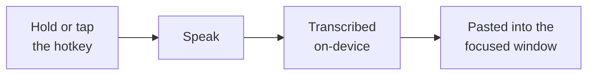
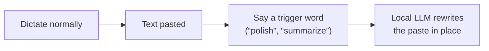

# dictatem

**Local, offline voice dictation for Windows & macOS.** Press a hotkey, speak,
and your words are transcribed on-device and pasted into whatever window has
focus. No cloud, no accounts, nothing leaves your machine.



Transcription is GPU-accelerated on Windows (NVIDIA) and runs on the CPU on macOS.

**Jump to install → [Windows](#windows) · [macOS](#macos)**

---

## Install

One command per platform. Both install [`uv`](https://docs.astral.sh/uv/) if
needed, install Dictatem pinned to the **v0.6.4** release, and launch it — the
tray / menu-bar icon appears a few seconds later. Everything runs as your own
user (no admin / `sudo`).

### Windows

Requires **Windows 11**, an x64 CPU, and ~8 GB RAM. An NVIDIA GPU is optional but
recommended (larger models, sub-realtime speed) — the installer auto-detects it
and picks the CUDA or CPU-lean dependency set for you. [Windows on ARM](docs/adr/0017-windows-on-arm-installs-under-x64-emulation.md)
is supported via x64 emulation.

Run in **PowerShell**:

```powershell
Set-ExecutionPolicy -Scope Process Bypass -Force; irm https://raw.githubusercontent.com/JohnJohn4/dictatem/v0.6.4/install.ps1 | iex
```

The leading `Set-ExecutionPolicy` clears a restrictive execution policy **for
this window only** (no admin, reverts when you close the terminal). The installer
also adds `dictatem` to your user `PATH`. Prefer to read the script first? Open
[the URL](https://raw.githubusercontent.com/JohnJohn4/dictatem/v0.6.4/install.ps1)
and run it once you're satisfied.

### macOS

Requires **macOS 12+** (Apple Silicon or Intel). Transcription runs on the CPU
([ADR-0013](docs/adr/0013-macos-transcription-engine.md)).

Run in **Terminal**:

```sh
curl -fsSL https://raw.githubusercontent.com/JohnJohn4/dictatem/v0.6.4/install.sh | sh
```

This generates `~/Applications/Dictatem.app` and starts Dictatem in the menu bar
via a per-user LaunchAgent (which also auto-starts it at login). On first launch
Dictatem walks you through the two macOS permission grants it needs —
**Accessibility** (to paste text) and **Input Monitoring** (to hear the hotkey);
**Microphone** is prompted on your first dictation. See
[Troubleshooting](#troubleshooting) below for the macOS details that trip people up.

> **macOS support is new.** The core flow is validated on Apple Silicon, but a
> few secondary flows are still being confirmed on-device
> ([#94](https://github.com/JohnJohn4/dictatem/issues/94),
> [#93](https://github.com/JohnJohn4/dictatem/issues/93)). Please file anything you hit.

Hacking on Dictatem instead of just running it? See [`docs/development.md`](docs/development.md).

---

## Using dictatem

The daemon lives in your system tray (Windows) / menu bar (macOS). Recording is
driven entirely by a global hotkey — **Win+Alt** on Windows, **Option+Command
(⌥⌘)** on macOS (both are the same configurable combo).

| Action | Gesture |
|---|---|
| **Push-to-talk** | **Hold** the hotkey, speak, release |
| **Toggle record** | **Tap** the hotkey to start; tap again (or pause) to stop |
| **Cancel** | Press **Esc** |

A tap starts hands-free recording that auto-stops after a stretch of silence; a
hold records only while held. Transcribed text is pasted into the focused window
automatically. While recording, a small **pill** appears in the corner of the
active screen with a live waveform.

**Dictation is never lost.** If text lands nowhere (no window focused, or focus
drifted mid-dictation), Dictatem holds it — focus where it should go and say
**"paste"**, or use **Copy last dictation** in the tray menu.

### Trigger Words

*Optional — rewrite the last paste by voice.* Right after a dictation is pasted,
say a single **trigger word** to rewrite that text in place with a local LLM — no
typing, no cloud.



Two triggers ship by default — **`polish`** (clean up filler and false starts)
and **`summarize`** (condense to notes). This feature is **off until you set up
[Ollama](#trigger-words-setup-ollama)** yourself. Add your own triggers by
dropping a markdown prompt file into `~/.dictatem/prompts/`.

### Tray / menu-bar menu

Right-click the icon for: **Start/Stop Recording**, **Copy last dictation**,
**Preload / Unload Model**, **Open config file…**, **How to use Dictatem…** (a
live in-app guide), **Check for Updates…** (Windows), **Show Log**, **Restart**,
**Quit**.

---

## Features

- **Global hotkey** — activate from any window; push-to-talk or hands-free toggle.
- **On-device transcription** — Faster-Whisper, GPU-accelerated on NVIDIA, CPU on macOS.
- **Offline after setup** — the model downloads once on first run; every dictation after that needs no network.
- **Smart paste** — saves and restores your clipboard and window focus around each paste, and never clutters clipboard history.
- **Trigger Words** — rewrite the last paste in place via a local Ollama model.
- **Custom vocabulary & replacements** — bias recognition toward your jargon, and rewrite words deterministically (see [Customising](#customising)).
- **Overlay pill** — corner indicator with a live waveform; encodes recording phase by colour.
- **Theme-adaptive tray icon** — stays visible on light or dark taskbars.
- **Discoverable config** — one hand-edited TOML file, no settings UI.

---

## Configuration

On first launch a commented default config is written to
`~/.dictatem/config.toml` — open it any time with **Open config file…** in the
tray menu. There is no settings UI ([by design](docs/adr/0022-no-settings-ui-config-is-a-discoverable-file.md));
the file is self-documented. The knobs you're most likely to touch:

```toml
[hotkey]
modifiers = ["win", "alt"]      # the combo; supported: win/meta, alt, ctrl, shift,
                                #   and mouse4 / mouse5 / middle
tap_threshold_ms = 200          # below this = toggle tap; above = push-to-talk hold

[model]
name = "large-v3-turbo"         # auto-picked from your hardware on first run
device = "cuda"                 # cuda or cpu
idle_unload_minutes = 30        # free the model's memory after this much idle time

[behaviour]
silence_timeout_s = 60          # auto-stop a toggle recording after this much silence

[startup]
autostart = true
preload_model = false           # load at startup vs. when you first arm a dictation

[transform]
enabled = true                  # master switch for Trigger Words
model_name = "gemma4:e2b"       # Ollama model tag; must match `ollama list`
```

### Model loading & memory

Dictatem doesn't hold the model in memory at startup. The load **starts the
instant you arm a dictation**, so it overlaps the seconds you spend talking — a
short utterance hides it entirely. If you stop before it finishes, the pill shows
a **"Loading…"** caption and transcribes automatically once ready (no need to
press the hotkey again). After `[model].idle_unload_minutes` of inactivity the
model **unloads** to free its memory (~3 GB of VRAM on a GPU) and reloads on your
next dictation.

Want an instant first response instead? Set `preload_model = true` under
`[startup]`, raise `idle_unload_minutes`, or use **Preload Model** in the tray menu.

### Customising

Alongside `config.toml`, Dictatem reads a few optional files in `~/.dictatem/`:

| File | What it does |
|---|---|
| `vocabulary.md` | Terms (names, jargon, acronyms) that bias transcription toward your spellings — one per line. |
| `replacements.md` | Deterministic `source => target` rewrites applied to every dictation. An empty target deletes the word (drop `um`/`uh`). Opt-in — ships with only commented examples. |
| `prompts/*.md` | One [Trigger Word](#trigger-words) per file: YAML frontmatter declares its aliases, the body is the prompt sent to the LLM. |

---

<a id="ollama--transform-setup"></a>

## Trigger Words setup (Ollama)

Trigger Words run a local [Ollama](https://ollama.com) model. Dictatem talks to a
running Ollama but never installs, starts, or pulls models for you
([ADR-0008](docs/adr/0008-dictatem-does-not-manage-ollama-lifecycle.md)). Three
one-time steps:

1. **Install Ollama** — from [ollama.com](https://ollama.com).
2. **Start the server** — `ollama serve` (the desktop app does this for you). It
   listens on `http://localhost:11434`, matching `[transform].base_url`.
3. **Pull the model** — `ollama pull gemma4:e2b` (or whatever you set in
   `[transform].model_name`). Confirm with `ollama list`.

Until all three are done, firing a trigger leaves your document untouched and the
overlay flashes a message telling you which step is missing.

---

## Updating

- **Windows** — right-click the tray icon → **Check for Updates…**. Dictatem
  compares against the latest GitHub release and, if newer, re-runs the installer
  for you (safe while running — it stops the old daemon first).
- **macOS** — re-run the [install one-liner](#macos); it refreshes the tool, the
  `.app`, and the start-at-login entry together. *(An in-app updater is not yet
  available on macOS.)*

You can also update either platform by re-running the one-liner with a newer
version tag in the URL — see the [latest release](https://github.com/JohnJohn4/dictatem/releases/latest).

## Uninstalling

Dictatem owns its start-at-login entry, so removing it cleanly is two steps (a
bare `uv tool uninstall` would orphan that entry and hit a file lock):

```powershell
dictatem --uninstall        # removes the autostart entry and stops the daemon
uv tool uninstall dictatem  # removes the tool
```

The same two steps apply on macOS (in Terminal) — step 1 also removes
`~/Applications/Dictatem.app` and its LaunchAgent. Your config under
`~/.dictatem` is left untouched.

---

## Troubleshooting

<details>
<summary><strong>The tray icon takes a few seconds to appear (or the first dictation lags)</strong></summary>

Expected on first launch, especially on managed / work machines: Windows or your
antivirus/EDR scans the freshly installed executable (and, on a GPU install, the
CUDA DLLs) once. It settles after the first run — it's the security software, not
a Dictatem fault.
</details>

<details>
<summary><strong>Forcing CPU or GPU on Windows</strong></summary>

The installer auto-detects an NVIDIA GPU. To override the **dependency set**, set
`DICTATEM_GPU` before running: `$env:DICTATEM_GPU='cpu'` (lean) or
`$env:DICTATEM_GPU='gpu'` (CUDA). This only chooses which libraries install, not
the runtime device — on a machine with an NVIDIA GPU the daemon still transcribes
on the GPU by default. Only force `cpu` on a genuinely GPU-less machine, or also
set `device = "cpu"` in your config. If you forced the set, set `DICTATEM_GPU`
again before a manual re-install (the tray update re-detects instead).
</details>

<details>
<summary><strong>macOS notes: permissions &amp; launch</strong></summary>

- **Let launchd run it.** Don't start Dictatem from Spotlight or by opening
  `Dictatem.app` (macOS then suppresses the menu-bar icon), and don't run
  `dictatem` from a bare terminal (macOS would attribute the permission grants to
  your *terminal app*, and the hotkey/paste would silently fail). To restart it:
  `launchctl kickstart -k gui/$(id -u)/com.dictatem.daemon`.
- **Grant `python3.12`, not "Dictatem".** Because the daemon runs as the
  uv-managed CPython, the System Settings privacy panes list the entry as
  **`python3.12`** — grant that. A signed, "Dictatem"-labelled bundle is planned
  ([#91](https://github.com/JohnJohn4/dictatem/issues/91)).
- **Before the grants are in,** the daemon still runs — record from the menu.
</details>

<details>
<summary><strong>Trigger Words don't fire</strong></summary>

Dictatem diagnoses this from Ollama's network response and flashes the cause:

| What's wrong | Fix |
|---|---|
| Ollama unreachable at `base_url` | Make sure it's running (`ollama serve`) and the URL matches `[transform].base_url`. |
| Server running but model not pulled | `ollama pull <model>` (confirm with `ollama list`). |
| HTTP 500 — `llama-server` crashed | See *Multi-GPU HTTP 500* below. |

A Trigger Fire also only runs if the focused window is still the one you pasted
into and the paste is younger than `[transform].last_paste_ttl_s` (default 5 min).
Switching windows or waiting too long discards the trigger silently.
</details>

<details>
<summary><strong>Multi-GPU HTTP 500 (<code>llama-server</code> crash)</strong></summary>

On a PC with **both an NVIDIA and an AMD GPU**, Ollama can crash `llama-server`
trying to initialise the AMD compute path. Force it onto CUDA:

```powershell
setx OLLAMA_LLM_LIBRARY "cuda"
setx OLLAMA_IGPU_ENABLE "0"
setx CUDA_VISIBLE_DEVICES "0"
setx OLLAMA_VULKAN "false"
```

Then **fully restart Ollama** (`setx` only affects newly started processes — quit
the tray app, confirm it's gone in Task Manager) and re-test with
`ollama run <model> --verbose`. Dictatem never sets these for you
([ADR-0008](docs/adr/0008-dictatem-does-not-manage-ollama-lifecycle.md)).
</details>

<details>
<summary><strong>Ollama on Windows: native vs WSL</strong></summary>

On a single-GPU machine where VRAM is tight, the **native Windows** Ollama build
beats running it in WSL: WSL's GPU-paravirtualization layer adds ~2 GB of VRAM
overhead (which can push the model to spill to CPU when Whisper is also loaded),
and native reads the model straight off NVMe (~5–10 s cold load vs ~50 s through
WSL's virtual disk). It serves on the same `http://localhost:11434`, so no
Dictatem config change is needed — install the Windows build, stop the WSL one,
and re-pull the model natively.
</details>

<details>
<summary><strong>Something else / verifying the install</strong></summary>

To confirm every dependency is wired up correctly (and check whether CUDA is
active), see the dependency-probe and end-to-end test in
[`docs/development.md`](docs/development.md#verify-the-setup).
</details>

---

## License

MIT
